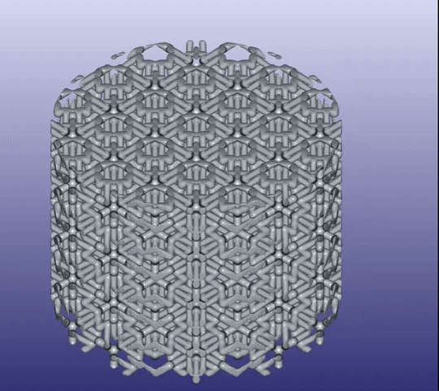

# README.md

Adding tactile sensors to my robots

Planning to use eFlesh: [Website: e-flesh.com](https://e-flesh.com/) | [Github repo](https://github.com/notvenky/eFlesh)

Which in turn seems inspired by [Reskin](https://reskin.dev/)

I am planning to instrument the [PincOpen gripper](https://pollen-robotics.github.io/PincOpen/) and install it on the [SO100ARM robotic arm](https://github.com/TheRobotStudio/SO-ARM100).

My intention is to open source the result. There is a very active growing community around the [lerobot project](https://github.com/huggingface/lerobot) sharing AI robotics training data. Today training is mainly using video, but making a low-cost tactile sensor available would allow using also touch inputs, which would open up many great possibilities

## BOM

* 3D Printing Filament 1.75mm TPU 95A (Flexible, Transparent Blue color) from [Amazon](https://www.amazon.es/dp/B07WGK7J48): 12.13€

* A pack of 220 ZENYKX 3x1mm N52 magnets from [Amazon](https://www.amazon.es/dp/B0DDH9M2YY): 8.99€ > may be too small

* A pack of 120 Wzone 5x2mm magnets from [Amazon](https://www.amazon.es/dp/B0CPT2S1XR): 9.99€  > not clear these are N52

* A pack of 50 Aprilheld 5x2mm N52 magnets from [Amazon](https://www.amazon.es/dp/B0D3YQ5KH3): 16.99€ > using these

* A Reskin sensor (60$ including shipping / tax) but Gerbers and BOM are available to send the PCBA for manufacturing, see: https://github.com/raunaqbhirangi/reskin_sensor/tree/main/circuits

* a QT Py

* a Qwiic/STEMMA cable

* a USB-C to USB-A cable


## 3D printing

Filament specs & manufacturer print settings:

* Filament diameter: 1.75 mm

* Dimensional accuracy: +/- 0.05 mm

* Extruder temperature: 190°C - 220°C

* Bed temperature: 40°C - 60°C

* Print speed: 10 - 30 mm/s

## Installation on Ubuntu 24.04 + Conda

### 1. Clone the repository with submodules

```bash
git clone --recurse-submodules https://github.com/notvenky/eFlesh.git
cd eFlesh
```

**Note:**
 I had no Github SSH keys set up in my machine, so I got the following error:

```
git@github.com: Permission denied (publickey)
fatal: Could not read from remote repository.
```

Fixed this setting up SSH keys in my machine iaw [GitHub’s official guide](https://docs.github.com/en/authentication/connecting-to-github-with-ssh/generating-a-new-ssh-key-and-adding-it-to-the-ssh-agent). After we can delete and clone again or just resume with:

```bash
git submodule update --init --recursive
```

### 2. Create and activate the Conda environment

```bash
conda env create -f env.yml
conda activate eflesh
```

### 3. Install Boost 1.83 and oneTBB using Conda

```bash
conda install -c conda-forge boost=1.83 tbb gmp mpfr notebook
```

### 4. Set up persistent environment variables

Create an activation hook:

```bash
mkdir -p $CONDA_PREFIX/etc/conda/activate.d
nano $CONDA_PREFIX/etc/conda/activate.d/env_vars.sh
```

Paste the following:

```bash
export BOOST_ROOT=$CONDA_PREFIX
export TBB_ROOT=$CONDA_PREFIX
```

Save and exit the editor, then reload the environment:

```bash
conda deactivate && conda activate eflesh
```

### 5. Patch the Build System

To prevent CMake from building its own (broken) version of Intel TBB, the following two changes must be made.

#### 5.1. Modify `microstructure/microstructure_inflators/cmake/MicroDependencies.cmake`

Comment out both blocks that begin with:

```cmake
if(NOT TARGET TBB::tbb)
```

This disables the download and build of the `3rdparty/tbb` code. After commenting out both blocks, CMake will fall back to system- or Conda-provided TBB.

#### 5.2. Modify `microstructure/microstructure_inflators/CMakeLists.txt`

After the line:

```cmake
include(MicroDependencies)
```

add the following:

```cmake
# Manually define TBB::tbb if not found (e.g., when using Conda)
if(NOT TARGET TBB::tbb)
    find_library(TBB_LIB tbb HINTS "${TBB_ROOT}/lib")
    if(TBB_LIB)
        add_library(TBB::tbb UNKNOWN IMPORTED)
        set_target_properties(TBB::tbb PROPERTIES
            IMPORTED_LOCATION "${TBB_LIB}"
            INTERFACE_INCLUDE_DIRECTORIES "${TBB_ROOT}/include"
        )
    else()
        message(FATAL_ERROR "TBB::tbb not found, and could not locate libtbb.so")
    endif()
endif()
```

This manually defines the missing `TBB::tbb` target expected by the build.

------

### 6. Build the C++ Tools

```bash
cd microstructure/microstructure_inflators
mkdir build && cd build

cmake .. \
  -DCMAKE_BUILD_TYPE=Release \
  -DBOOST_ROOT=$CONDA_PREFIX \
  -DTBB_ROOT=$CONDA_PREFIX \
  -DGMP_INCLUDE_DIR=$CONDA_PREFIX/include \
  -DGMP_LIBRARIES=$CONDA_PREFIX/lib/libgmp.so \
  -DMPFR_INCLUDE_DIR=$CONDA_PREFIX/include \
  -DMPFR_LIBRARIES=$CONDA_PREFIX/lib/libmpfr.so \
  -DMICRO_BUILD_BINARIES=ON

make -j2 stitch_cells_cli
make -j2 cut_cells_cli
make -j2 stack_cells
```

Note I added paths to GMP and MPFR missing dependencies. note also -DMICRO_BUILD_BINARIES=ON otherwise it wont build the binaries

Also I used a more conservative option for compiling to avoid freezing my system

This will build the tools:

- `stitch_cells_cli`
- `cut_cells_cli`
- `stack_cells`

These binaries should appear in the `build/` directory.

### 7. Test the build

```bash
./isosurface_inflator/stitch_cells_cli --help
stitch_cells_cli
Usage: ./build/isosurface_inflator/stitch_cells_cli [OPTIONS] patch

Positionals:
  patch TEXT REQUIRED         Patch description (json file).

Options:
  -h,--help                   Print this help message and exit
  -p,--patch TEXT REQUIRED    Patch description (json file).
  --gridSize FLOAT REQUIRED   Grid size.
  --surface TEXT              Object surface.
  -o,--output TEXT            Output triangle mesh.
  -r,--resolution INT         Density field resolution.
  --final_adaptivity FLOAT    adaptivity of final mesh.

```

## Usage

Activate conda environment, from the project root launch:

```bash
$ cd ~/eFlesh
$ conda activate eflesh
(eflesh)$ jupiter notebook
```

Install missing dependencies`igl` ,`meshio`, `pandas`needed to execute `cut-cell.ipynb`:

```bash
(eflesh)$ conda install -c conda-forge igl meshio pandas
```

Open the `regular.ipynb` or `cut-cell.ipynb` notebooks to start exploring the functionality.

Update ocurrences of  `path/to` by `/home/mhered/eFlesh/microstructure` in files:

* `/home/mhered/eFlesh/microstructure/microstructure_inflators/regular.ipynb`

* `/home/mhered/eFlesh/microstructure/microstructure_inflators/cut-cell.ipynb`

Edit parameters, finally got this 40x40x30mm cube (`40x40x30_0.01_8.obj_False.obj`):

s

And R20x30mm cylinder:



## Printing TPU

I am printing on an Ender 3 Max. Apparently the Bowden tube is a liability. ChatGPT generated a config file for Prusa Slicer (can't get CURA to work)

File > Import > Import Config

[Config_TPU_Ender3_Max_v1.ini](./3D_printer_configs/Config_TPU_Ender3_Max_v1.ini) - created by ChatGPT

[Config_TPU_Ender3_Max_v2.ini](./3D_printer_configs/Config_TPU_Ender3_Max_v3.ini)- advice from repo added (with errors fixed by me)

[Config_TPU_Ender3_Max_v3.ini](./3D_printer_configs/Config_TPU_Ender3_Max_v3.ini) - advice from repo added and errors fixed by ChatGPT


Not sure this is the way this is supposed to be... Instead, I hacked together a quick prototype by gluing two pieces of sponge from a dish scrubber to hold the magnets in place.

## Install the QT Py firmware to get the sensor to start streaming data

1) Set up the QT Py board using the Arduino IDE (refer to this tutorial https://learn.adafruit.com/adafruit-qt-py/arduino-ide-setup):
   1) Install Arduino IDE: [download the AppImage](https://www.arduino.cc/en/software/), then (I use [AppimageLauncher](https://github.com/TheAssassin/AppImageLauncher)) copy to `~/Applications/` folder, make it executable (`$ chmod +x <filename>`) and run it.
   2) In **Preferences** > **Settings** > **Additional Boards Manager URLs** paste the link: https://adafruit.github.io/arduino-board-index/package_adafruit_index.json to add support for Adafruit boards (including the QT Py)
   3) In **Tools** > **Board** > **Boards Manager...** install the latest versions of **Arduino SAMD Boards** and **Adafruit SAMD Boards** packages. Close and reopen Arduino IDE for changes to take effect.
   4) In **Tools** > **Board**  select **Adafruit QT Py M0 (SMAD21)**
   5) Plug the QT Py board USB to the laptop, wait for it to be recognized and connect to it in **Tools** > **Port** (will show as **/dev/ttyACM1 (Adafruit QT Py M0 (SMAD21))** ) 
   6) May want to follow [this tutorial](https://learn.adafruit.com/adafruit-qt-py/neopixel-blink) to upload the blinking "Hello world" (actually requires installing the Neopixel library)

2) Manually install [this library for the MLX90393 magnetometer](https://github.com/tesshellebrekers/arduino-MLX90393) (refer to [this tutorial](https://learn.adafruit.com/adafruit-all-about-arduino-libraries-install-use/how-to-install-a-library)). Note there are other MLX90303 libraries that can be installed with the **Library Manager**, but I have not checked if they are compatible with the reskin python scripts

   1. Clone the library repo inside the `libraries`folder (the exact path can be consulted in **Preferences** > **Settings** > **Sketchbook location** ):

   ```
   $ cd <path_to_sketchbook>/libraries
   $ git clone https://github.com/tesshellebrekers/arduino-MLX90393.git
   ```

   2. It's successful when `arduino-MLX90393` shows in **File** > **Examples** (Note the tutorial claims you need to rename to replace `-`by `_` then close and reopen the IDE, but this seems unnecessary).
   3. Note: I fixed a couple of error messages (a mismatch of parameters in a function call and a couple of typecastings) to compile the `MLX90393_Debug_Helper.ino` firmware, but could not get it to work. 

3. Manually upload the sensor firmware to the QT Py. 

   1. Copy the two folders `5X_burst_stream` and `5X_binary_burst_stream` from https://github.com/raunaqbhirangi/reskin_sensor/tree/main/arduino into the Sketchbook location. 

   2. May want to upload `5X_burst_stream.ino` which sends a stream of plain text data for a quick check using the **Serial Monitor** and **Serial Plotter**: even with the kitchen sponge... it works!

      

   3. Must upload instead`5X_binary_burst_stream.ino`, which streams binary data, in order to execute the python test scripts from https://github.com/raunaqbhirangi/reskin_sensor/tree/main/tests, e.g. 

```
$ python3 sensor_proc_test.py -p /dev/ttyACM1
Initializing sensor...
Initialization successful
Started streaming
Time elapsed: 2.0012900829315186, Number of datapoints: 746
Columns:  T0, 	Bx0, 	By0, 	Bz0, 	T1, 	Bx1, 	By1, 	Bz1, 	T2, 	Bx2, 	By2, 	Bz2, 	T3, 	Bx3, 	By3, 	Bz3, 	T4, 	Bx4, 	By4, Bz4
Sample 1: ['30.46', '-35.40', '43.95', '-82.76', '28.50', '60.00', '-138.75', '-107.45', '29.31', '-221.10', '-103.35', '-119.31', '28.65', '128.70', '-28.95', '-102.12', '29.93', '-13.65', '-10.20', '-74.78']
Sample 2: ['30.58', '-31.05', '42.90', '-85.67', '28.58', '62.70', '-139.95', '-108.42', '29.31', '-233.40', '-111.45', '-118.82', '28.65', '130.80', '-41.25', '-103.58', '29.87', '-15.60', '-7.50', '-77.92']
Sample 3: ['30.20', '-38.25', '40.20', '-90.02', '28.67', '55.80', '-138.75', '-103.33', '29.51', '-225.15', '-114.75', '-114.47', '28.65', '130.95', '-34.95', '-96.32', '29.62', '-10.05', '-7.20', '-74.78']
Sample 4: ['30.22', '-35.70', '43.20', '-83.25', '28.52', '57.45', '-138.90', '-106.96', '29.25', '-227.25', '-107.10', '-112.29', '28.38', '133.95', '-43.35', '-99.46', '29.76', '-10.05', '-7.35', '-74.78']
Sample 5: ['30.42', '-33.60', '43.50', '-98.74', '28.61', '53.70', '-146.40', '-108.66', '29.42', '-220.95', '-114.15', '-118.10', '28.56', '123.30', '-32.10', '-101.40', '29.76', '-14.10', '-4.50', '-83.97']
```

4. Same for the visualizer scripts, e.g.

```
$ python3 viz_eflesh.py -p /dev/ttyACM1
/home/mhered/miniconda3/envs/eflesh/lib/python3.10/site-packages/pygame/pkgdata.py:25: UserWarning: pkg_resources is deprecated as an API. See https://setuptools.pypa.io/en/latest/pkg_resources.html. The pkg_resources package is slated for removal as early as 2025-11-30. Refrain from using this package or pin to Setuptools<81.
  from pkg_resources import resource_stream, resource_exists
Initializing sensor...
Initialization successful
Started streaming
```


Some fine tuning necessary...